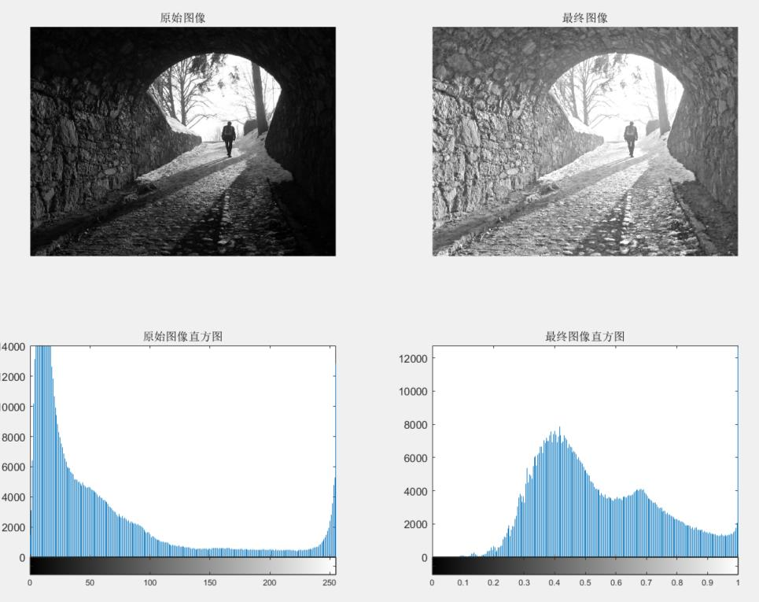
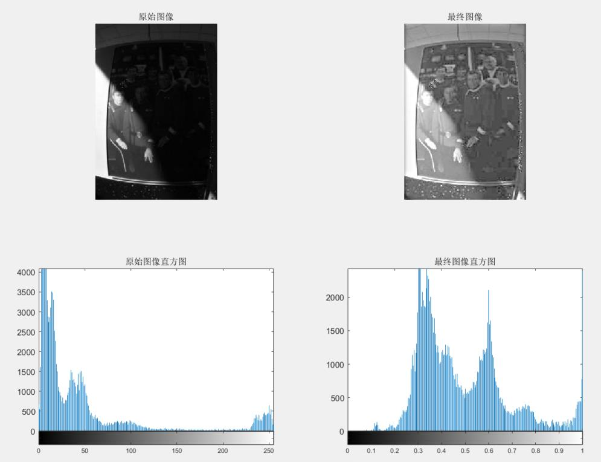
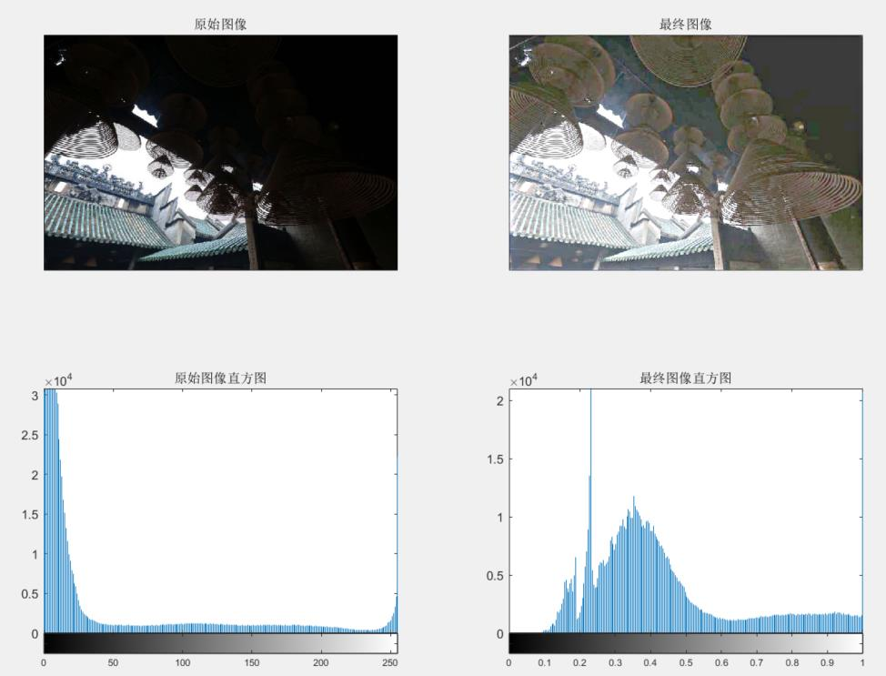

# 项目概要
该项目是数字图像处理课后实验，题目为“**图像同态滤波**”。  
该项目使用软件及版本为`Matlab 2019a`。  
该项目实现了图像同态滤波，可以调整光照局部过亮的图像对比度。

---
# 代码结构
- ### **Homomorphic_filter.m**  
输入： 

    Image_Target [m*n*k (uint8)]: 目标图像 k=1 时为黑白图像，k=3 时为彩色图像
    rH, rL (double): 函数所需高通滤波器的上限与下限
    c (double): 高通滤波器过渡部分的锐利度
    D0 (uint)： 高通滤波器截止频率到原点的距离

输出：

    Image_Final [m*n*k (uint8)]：同态滤波后的图像

操作流程：

    图像函数取对数 -> 二维傅里叶变换 -> 高通滤波 -> 二维傅里叶逆变换 -> 取指数

函数功能：

    对输入的图像根据输入的高通滤波参数进行同态滤波操作

- ### **main.m**  
功能：

    脚本执行文件

---
# 成果展示

